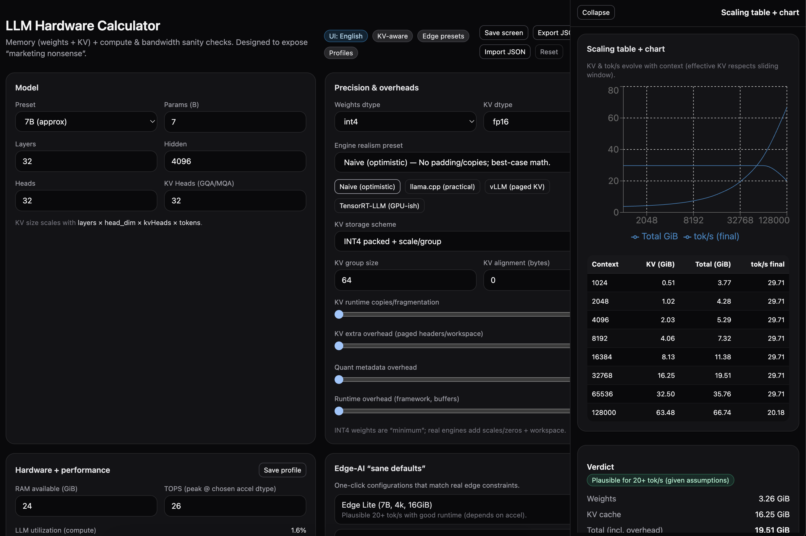

https://dzzk-r.github.io/llm-hw-calculator/



# LLM Hardware Calculator (React + Vite + Tailwind + Recharts)

KV-aware, edge-oriented LLM hardware sanity checker.

Designed to expose unrealistic marketing claims such as:

> "30B model, 128k context, 16GB DDR4, 20+ tok/s"

---

## Features

- Separate modeling of **weights vs KV cache**
- Realistic KV alignment and fragmentation modeling
- Engine presets (llama.cpp, vLLM, TRT-LLM)
- Compute-bound vs bandwidth-bound tok/s
- Sliding window realism
- Side panel scaling chart
- Local profile storage

---

## Demo

https://dzzk-r.github.io/llm-hw-calculator/


## Run locally
```bash
npm i
npm run dev
```

## Build
```bash
npm run build
npm run preview
```

## Deploy
This is a static Vite build. Most hosts use:
- Build command: `npm run build`
- Publish directory: `dist`

# v0.3-alpha

Constraint-Aware Edge Inference Modeling Framework.

Core thesis:
> TOPS != tok/s

v0.3 introduces structured constraint modeling across three UI layers.

See docs/ for architectural alignment and competitive context.
